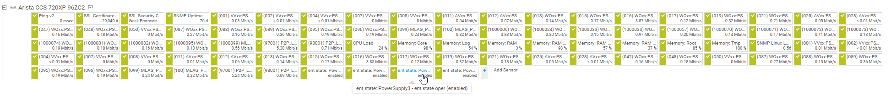
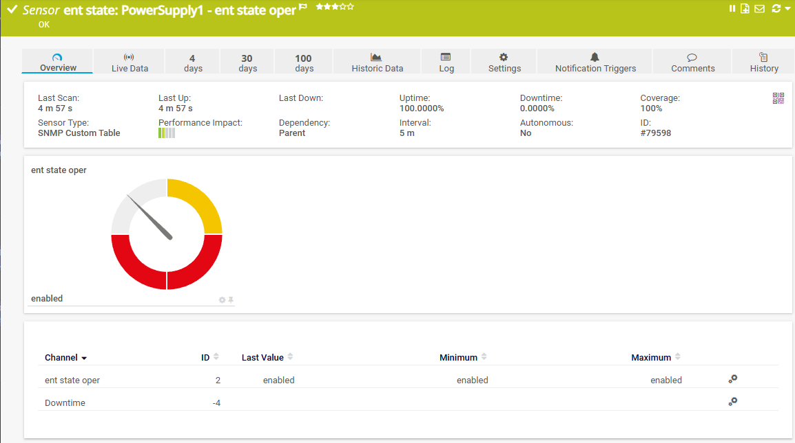

# PRTG PSU Sensor Deployer

Automated Power Supply Unit (PSU) health monitoring sensor deployment for PRTG Network Monitor using [PrtgAPI](https://github.com/lordmilko/PrtgAPI).

## Features

- Bulk deploy PSU health sensors to Arista switches and Palo Alto firewalls
- Auto-detects PSU count per device (handles 1, 2, or more PSUs)
- WhatIf mode for safe testing before deployment
- Detailed CSV reports of all operations
- Skips devices that already have PSU sensors
- Supports multiple PRTG servers

## Screenshots

### Device Overview

*PSU sensors displayed alongside other device sensors*

### Sensor Detail

*Individual PSU sensor showing "enabled" status with uptime statistics*

## Requirements

- PowerShell 5.1 or later
- [PrtgAPI PowerShell Module](https://github.com/lordmilko/PrtgAPI)
- PRTG Network Monitor with SNMP credentials configured on target devices
- Custom OIDLIB file: `Arista & PA Hardware State.oidlib` (for ENTITY-STATE-MIB)

## Installation

1. Install the PrtgAPI module:
   ```powershell
   Install-Module PrtgAPI -Scope CurrentUser
   ```

2. Clone this repository:
   ```powershell
   git clone https://github.com/CC-Digital-Innovation/prtg-psu-sensor-deployer.git
   cd prtg-psu-sensor-deployer
   ```

3. Copy the sample config and add your credentials:
   ```powershell
   Copy-Item config.sample.ps1 config.ps1
   # Edit config.ps1 with your PRTG server details
   ```

4. Install the OIDLIB file on your PRTG server(s):

   Copy `Arista & PA Hardware State.oidlib` to the SNMP library folder:
   ```
   C:\Program Files (x86)\PRTG Network Monitor\snmplibs\
   ```

   **Note:** The OIDLIB only needs to be installed on the PRTG core server, not on remote probes.

   After copying, reload the libraries using one of these methods:
   - **PRTG Web UI:** Setup > Administrative Tools > Load Lookups and File Lists
   - **Or** restart the PRTG Probe Service

5. **(Recommended)** Install the lookup file for proper alert levels:

   Copy `oid.entity-state-mib.entstate.entstateoper.ovl` to the custom lookups folder:
   ```
   C:\Program Files (x86)\PRTG Network Monitor\lookups\custom\
   ```

   Then reload lookups via **Setup > Administrative Tools > Load Lookups and File Lists**.

   This lookup file controls how PRTG displays and alerts on PSU states. The default alert levels are:

   | Value | State | Default Alert Level |
   |-------|-------|---------------------|
   | 1 | unknown | Error |
   | 2 | disabled | Error |
   | 3 | enabled | OK (None) |
   | 4 | testing | Warning |

   **Note:** You can customize these alert levels by editing the `.ovl` file. Change the `state` attribute to `None`, `Warning`, or `Error` based on your monitoring requirements.

## Usage

### Test Run (WhatIf Mode)
```powershell
.\deploy_all_psu_sensors.ps1 -Server prtg.example.com -WhatIf
```

### Full Deployment
```powershell
.\deploy_all_psu_sensors.ps1 -Server prtg.example.com
```

### Parameters

| Parameter | Description | Default |
|-----------|-------------|---------|
| `-Server` | PRTG server hostname | Required |
| `-WhatIf` | Test mode - no changes made | False |
| `-ReportPath` | Path for CSV report | `psu_deployment_<server>.csv` |
| `-MaxDevices` | Limit devices for testing (0 = all) | 0 |

## How It Works

1. Connects to your PRTG server using PrtgAPI
2. Discovers all Arista switches and Palo Alto firewalls (excluding APs and Panorama)
3. For each device:
   - Checks for existing PSU sensors (skips if found)
   - Queries SNMP Library targets using the OIDLIB
   - Filters for PSU-related ENTITY-STATE-MIB OIDs
   - Creates sensors for each discovered PSU
4. Generates a CSV report of all actions

## Supported Devices

| Vendor | Models Tested | Notes |
|--------|---------------|-------|
| Arista | 7050, 7280, 7500 series | Excludes C-260/O-235 APs |
| Palo Alto | PA-5220, PA-5250 | Excludes Panorama |

## SNMP Library Sensor Notes

This script uses SNMP Library sensors which require special handling due to [PrtgAPI issues #47](https://github.com/lordmilko/PrtgAPI/issues/47) and [#98](https://github.com/lordmilko/PrtgAPI/issues/98):

- Uses `-DynamicType` flag to handle sensor type changes during creation
- The `interfacenumber__check` value must be the full Properties array joined with pipes (not just the OID)

## Output

The script generates a CSV report with the following columns:

| Column | Description |
|--------|-------------|
| Timestamp | When the device was processed |
| DeviceId | PRTG device ID |
| DeviceName | Device name in PRTG |
| Vendor | Arista or PaloAlto |
| Model | Device model extracted from name |
| Group | PRTG group containing the device |
| PsusFound | Number of PSUs discovered |
| SensorsCreated | Number of sensors created |
| SensorIds | Comma-separated list of new sensor IDs |
| Status | Success, Skipped, or Error |
| Message | Details about the operation |

### Sensor Values (ENTITY-STATE-MIB entStateOper)

| Value | State | Meaning |
|-------|-------|---------|
| 1 | unknown | State cannot be determined |
| 2 | disabled | PSU not active |
| 3 | enabled | PSU operating normally |
| 4 | testing | PSU in test mode |

## Configuration

Create a `config.ps1` file with your credentials (see `config.sample.ps1`):

```powershell
$PrtgConfig = @{
    Server = "prtg.example.com"
    Username = "your-username"
    Password = "your-password"  # Or use PassHash for better security
}
```

## Troubleshooting

### Device times out during SNMP discovery
- Verify SNMP credentials are configured on the device in PRTG
- Check that the device supports ENTITY-STATE-MIB

### No PSU targets found
- Ensure the `Arista & PA Hardware State.oidlib` file is installed on your PRTG core server
- Verify the device has SNMP enabled and accessible

### Sensor creation fails
- Check PRTG user has permissions to create sensors
- Verify the target device is accessible from the PRTG probe

## Rollback

Remove all PSU sensors by tag:
```powershell
Import-Module PrtgAPI
Connect-PrtgServer prtg.example.com (New-Credential 'username' 'password') -IgnoreSSL
Get-Sensor -Tags "psu" | Remove-Object -Force
```

## License

MIT License - See [LICENSE](LICENSE) file

## Acknowledgments

- [lordmilko/PrtgAPI](https://github.com/lordmilko/PrtgAPI) - Excellent PowerShell module for PRTG
- [JustinGrote's SNMP Library Gist](https://gist.github.com/JustinGrote/d39ce1c1f398aa53354fdbc0b46b3049) - Reference for SNMP Library sensor creation
